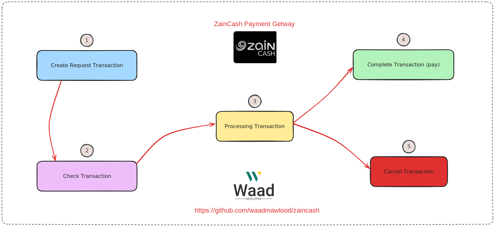

# ZainCash Integration API Laravel Package

<p>
<a href="https://zaincash.iq" target="_blank"></a>
</p>

This is a Laravel package to integrate ZainCash payment gateway API. For local financial transactions in Iraqi dinars inside Iraq. This package is based on the official ZainCash API documentation. You can find the official documentation [(https://docs.zaincash.iq)](https://docs.zaincash.iq).

<p>
<a href="https://packagist.org/packages/waad/zaincash"></a>
<a href="https://packagist.org/packages/waad/zaincash"></a>
<a href="https://packagist.org/packages/waad/zaincash"></a>
</p>

## 🎀 Requirements
| Package Version | Laravel Version | PHP Version  |
|-----------------|-----------------|--------------|
| 6.x             | 6.x             | 7.2+         |
| 7.x             | 7.x             | 7.2.5+       |
| 8.x             | 8.x             | 7.3+ \| 8.0+ |
| 9.x             | 9.x             | 8.0+         |
| 10.x            | 10.x            | 8.1+         |


## 📌 Installation
```bash
composer require waad/zaincash
```

<!-- <br> -->

<!-- 🔴 Add `ZainCashServiceProvider` to `config/app.php` file
```php
'providers' => [
    /*
    * Package Service Providers...
     */
    Waad\ZainCash\ZainCashServiceProvider::class,
    ....
],

'aliases' => [
    ...
    'ZainCash' => Waad\ZainCash\Facades\ZainCash::class,
],
``` -->

<br>

publish config file to `config/zaincash.php`
```bash
php artisan vendor:publish --tag="zaincash"
```

update config zaincash in `config/zaincash.php` or from `.env` file


| Key | Type | Default | Description |
|-----|------|---------|-------------|
| msisdn                | string | 9647835077893 | The mobile phone number for your wallet, provided by Zain Cash. Example format: 9647835077893. |
| merchant_id           | string | 5ffacf6612b5777c6d44266f | The Merchant ID obtained from ZainCash. |
| secret                | string | $2y$10$h................ | The secret used to decode and encode JWT during requests. Obtain from ZainCash. |
| test                  | bool | true | Specify the environment for using the ZainCash API. Set 'test' to false for the live environment after obtaining all credentials from ZainCash. |
| test_url              | string | https://test.zaincash.iq/ | URL for the ZainCash test environment. |
| live_url              | string | https://api.zaincash.iq/  | URL for the ZainCash live environment. |
| language              | string | ar | Set the language for the ZainCash payment page. Use 'ar' for Arabic or 'en' for English. |
| prefix_order_id       | string | wa3d_ | Prefix for the order ID. |
| is_redirect           | bool   | false   | Specify whether or not to redirect to the ZainCash payment page. If false, ZainCash returns a Transaction ID to the backend. If true, redirection after the request. |
| min_amount            | int    | 1000  | Set the minimum amount for a valid transaction in Iraqi Dinar (IQD). Transactions with amounts less than this value will be considered invalid.  |


<br>

Configurations to `.env` file
```env
ZAINCASH_MSISDN=9647835077893                  # Test Credentials
ZAINCASH_MERCHANT_ID=5ffacf6612b5777c6d44266f  # Test Credentials
ZAINCASH_SECRET=$2y$10$h................       # Test Credentials
ZAINCASH_TEST=true                             # default true 
ZAINCASH_PREFIX_ORDER_ID=wa3d_                 # default wa3d_
ZAINCASH_LANGUAGE=ar                           # optional default ar
ZAINCASH_IS_REDIRECT=false                     # optional default false
ZAINCASH_MIN_AMOUNT=1000                       # optional default 1000
ZAINCASH_TEST_URL=https://test.zaincash.iq/    # optional
ZAINCASH_LIVE_URL=https://api.zaincash.iq/     # optional
```


```bash
php artisan optimize
```

<br>
<br>


## 🍔 Usage

use `ZainCash` Facade or Class example

<div style="display: flex;">
<div style="flex: 1; padding: 10px; border: 1px solid #ccc;">
<b>Facade</b>

```php
<?php

namespace App\Http\Controllers\Api;

use App\Http\Controllers\Controller;
use App\Http\Requests\Payment
\InitialPaymentRequest;
use Illuminate\Support\Str;
use Waad\ZainCash\Facades\ZainCash;

class PaymentController extends Controller
{
    /**
     * Create Request Transaction
     *
     * @param InitialPaymentRequest $request
     * @return \Illuminate\Http\JsonResponse
     */
    public function initialTransaction
    (InitialPaymentRequest $request)
    {
        $zainCashPayment = 
            ZainCash::setAmount($request->amount)
            ->setServiceType('Book')
            ->setOrderId(Str::random(36))
            ->setIsTest(true)
            ->setIsReturnArray(true);

        return response()->json( 
            $zainCashPayment->createTransaction()
            );
    }
}
```

</div>

<div style="flex: 1; padding: 10px; border: 1px solid #ccc;">
<b>Class</b>

```php
<?php

namespace App\Http\Controllers\Api;

use App\Http\Controllers\Controller;
use App\Http\Requests\Payment
\InitialPaymentRequest;
use Illuminate\Support\Str;
use Waad\ZainCash\ZainCash;

class PaymentController extends Controller
{
    /**
     * Create Request Transaction
     *
     * @param InitialPaymentRequest $request
     * @return \Illuminate\Http\JsonResponse
     */
    public function initialTransaction
    (InitialPaymentRequest $request)
    {
        $zainCashPayment = ZainCash::make()
            ->setAmount($request->amount)
            ->setServiceType('Book')
            ->setOrderId(Str::random(36))
            ->setIsTest(true)
            ->setIsReturnArray(true);

        return response()->json( 
        $zainCashPayment->createTransaction()
        );
    }
}
```

</div>
</div>

<br>


####- `Getter` And `Setter`  Attributes Table


| Attribute         |Important| Type             | Getter                                | Setter                                 | Default  |
|-------------------|--|------------------|---------------------------------------|----------------------------------------|----------|
| amount            |🟢| int-float-null   | `getAmount()`                         | `setAmount($amount)`                   | -        |
| serviceType       |🟢| string-null      | `getServiceType()`                    | `setServiceType($serviceType)`         | -        |
| orderId           |🟢| string-int-float-null | `getOrderId()`                   | `setOrderId($orderId)`                 | -        |
| transactionID     |🟢| string-null      | `getTransactionID()`                  | `setTransactionID($transactionID)`     | -        |
| isReturnArray     |🟢| bool             | `getIsReturnArray()`                  | `setIsReturnArray($isReturnArray)`     | false    |
| minAmount         |🔴| int-float-null   | `getMinAmount()`                      | `setMinAmount($minAmount)`             | -        |
| msisdn            |🔴| string-null      | `getMsisdn()`                         | `setMsisdn($msisdn)`                   | -        |
| secret            |🔴| string-null      | `getSecret()`                         | `setSecret($secret)`                   | -        |
| merchantId        |🔴| string-null      | `getMerchantId()`                     | `setMerchantId($merchantId)`           | -        |
| isTest            |🔴| bool-null        | `getIsTest()`                         | `setIsTest($isTest)`                   | -        |
| language          |🔴| string-null      | `getLanguage()`                       | `setLanguage($language)`               | -        |
| baseUrl           |🔴| string-null      | `getBaseUrl()`                        | `setBaseUrl($baseUrl)`                 | -        |
| isRedirect        |🔴| bool             | `getIsRedirect()`                     | `setIsRedirect($isRedirect)`           | -        |
| tUrl              |🔴| string-null      | `getTUrl()`                           | `setTUrl($tUrl)`                       | -        |
| cUrl              |🔴| string-null      | `getCUrl()`                           | `setCUrl($cUrl)`                       | -        |
| rUrl              |🔴| string-null      | `getRUrl()`                           | `setRUrl($rUrl)`                       | -        |
| processingUrl     |🔴| string-null      | `getProcessingUrl()`                  | `setProcessingUrl($processingUrl)`     | -        |
| processingOtpUrl  |🔴| string-null      | `getProcessingOtpUrl()`               | `setProcessingOtpUrl($processingOtpUrl)` | -      |
| cancelUrl         |🔴| string-null      | `getCancelUrl()`                      | `setCancelUrl($cancelUrl)`             | -        |

⚠️ `Important` column means that this attribute is constantly used and has no default value. On the contrary, we can change it, but it will take the default value from `config/zaincash.php`.


<br>


### - **Steps from create a transaction To Complete Payment**

#### **<span style="color: blue">Step 1 - </span><span style="color: red">Create a transaction</span>**

```php
    $zainCashPayment = ZainCash::make()
        ->setAmount($request->amount)
        ->setServiceType('Book')
        ->setOrderId(Str::random(36))
        ->setIsTest(true);
```

- `setAmount($amount)` : Set the amount of the transaction in Iraqi Dinar (IQD). The amount must be greater than or equal to the minimum amount specified in the configuration file.
- `setServiceType($serviceType)` : Set the service type for the transaction. The service type must be one of the following: `Book`, `Food`, `Grocery`, `Pharmacy`, `Transportation`, `Other`.
- `setOrderId($orderId)` : Set the order ID for the transaction. The order ID must be unique for each transaction.
- `setIsTest($isTest)` : Set the environment for using the ZainCash API. Set `true` for the test environment and `false` for the live environment.
- `setIsReturnArray(bool)` : Set the return type for the transaction. Set `true` to return an **array** and `false` to return an **object stdClass**. The default value is `false`.
- `createTransaction()` : Create a transaction and return the transaction Details (**array** or **object stdClass**).

<br>

```php
    $transaction = $zainCashPayment->createTransaction();
```
<br>

Response example
```json
{
  "source": "web",
  "type": "MERCHANT_PAYMENT",
  "amount": "1000",
  "to": "5ffacf6612b5777c6d44266f",
  "serviceType": "Book",
  "lang": "ar",
  "orderId": "wa3d_Q9IpdkNw7EVypwLRuE2PDDoVLA4FPhAjhlyO",
  "currencyConversion": {},
  "referenceNumber": "RGUR9Q",
  "credit": false,
  "status": "pending",
  "reversed": false,
  "createdAt": "2023-11-18T08:24:32.467Z",
  "updatedAt": "2023-11-18T08:24:32.467Z",
  "id": "655874c00227c4d2ec58f710"
}
```

```php
// if return array use ->setIsReturnArray(true);

    $transactionId = $transaction['id'];

// if return object use ->setIsReturnArray(false); -- default
    $transactionId = $transaction->id;
```

<br>
<br>


#### **<span style="color: blue">Step 2 - </span><span style="color: red">Check a transaction</span>**

```php
    $zainCashPayment = ZainCash::make()
        ->setTransactionID($transactionID)
        ->setIsReturnArray(true);
```

- `setTransactionID($transactionID)` : Set the transaction ID for the transaction.
- `setIsReturnArray(bool)` : Set the return type for the transaction. Set `true` to return an **array** and `false` to return an **object stdClass**. The default value is `false`.
- `checkTransaction()` : Check the transaction and return the transaction details (**array** or **stdClass**).

<br>

```php
    $transactionDetails = $zainCashPayment->checkTransaction();
```
<br>

Response Example dependent by status:

```json
{
    "to": {
        "name": "Karrar",
        "msisdn": "9647835077893",
        "currency": "IQD",
        "deleted": false,
        "pay_by_reference": "1",
        "createdAt": "2021-01-10T09:56:54.180Z",
        "updatedAt": "2021-12-22T13:01:02.531Z",
        "id": "5ffacf6612b5777c6d44266f"
    },
    "source": "web",
    "type": "MERCHANT_PAYMENT",
    "amount": "1000",
    "serviceType": "Book",
    "lang": "ar",
    "orderId": "wa3d_2eTDlz8umPE3DwtocL5O8Xpe10yLH4pepci2",
    "currencyConversion": [],
    "referenceNumber": "MDJN1I",
    "credit": false,
    "status": "pending",  // pending, pending_otp, completed, failed, cancel
    "reversed": false,
    "createdAt": "2023-11-18T11:37:16.574Z",
    "updatedAt": "2023-11-18T11:37:16.574Z",
    "id": "6558a1ec0227c4d2ec58f717"
}
*****************************************
{
  "to": {
    ....
  },
  ...
  "status": "pending_otp", // <--- status pending_otp after processing
  "sofOwnerId": 18482,
  "traveldiscount": "10000",
  "from": "9647802999569",
  "onCustomerFees": "50000000",
  "onMerchantFees": "0",
  "totalFees": 500,
  ...
}
*****************************************
{
  "to": {
    ...
  },
  ...
  "status": "completed", // <--- status completed after complete (Payment)
  ...
}
*****************************************
{
  "to": {
    ...
  },
  ...
  "status": "failed", // <--- status failed that mean there is (expiration or a wrong)
  "sofOwnerId": 18482,
  "traveldiscount": "9900",
  "from": "9647802999569",
  "onCustomerFees": "50000000",
  "onMerchantFees": "0",
  "totalFees": 500,
  "due": "Not enough credit on balance",
  ...
}
*****************************************
{
  "to": {
    ...
  },
  ...
  "status": "cancel", // <--- status cancel it mean the user cancel the transaction
  "sofOwnerId": 18482,
  "traveldiscount": "10000",
  "from": "9647802999569",
  "onCustomerFees": "50000000",
  "onMerchantFees": "0",
  "totalFees": 500,
  "due": "transaction_already_submitted",
  ...
}
```


```php
// if return array use ->setIsReturnArray(true);

    $status = $transactionDetails['status'];
    $name = $transactionDetails['to']['name'];

// if return object use ->setIsReturnArray(false); -- default
    $status = $transactionDetails->status;
    $name = $transactionDetails->to->name;
```

<br>
<br>


#### **<span style="color: blue">Step 3 - </span><span style="color: red">Processing a transaction</span>**

```php
    $zainCashPayment = ZainCash::make()
        ->setTransactionID($transactionID)
        ->setIsReturnArray(true);
```

- `setTransactionID($transactionID)` : Set the transaction ID for the transaction.
- `setIsReturnArray(bool)` : Set the return type for the transaction. Set `true` to return an **array** and `false` to return an **object stdClass**. The default value is `false`.
- `processingTransaction($phonenumber, $pin)` : Processing the transaction and return the transaction details (**array** or **object stdClass**).

<br>

```php
$processingDetails = $zainCashPayment->processingTransaction("9647802999569", '1234');
```

<br>

Response Example dependent by success:

```json
{
  "success": 1,
  "transactionid": "655883cd0227c4d2ec58f712",
  "initialAmount": "1000",
  "totalFees": 500,
  "discount": "1000",
  "total": 1500,
  "onCustomerFees": "50000000",
  "onMerchantFees": "0"
}
********************************************
{
  "success": 0,
  "error": "العملية قد قدمت من قبل"
}
********************************************
{
  "success": 0,
  "error": "رقم المحفظة-الهاتف أو الرمز السري غير صحيح"
}
```

```php
// if return array use ->setIsReturnArray(true);

    $success = $processingDetails['success'];

// if return object use ->setIsReturnArray(false); -- default
    $success = $processingDetails->success;
```

<br>
<br>


#### **<span style="color: blue">Step 4 - </span><span style="color: red">Complete a transaction</span>**

```php
    $zainCashPayment = ZainCash::make()
        ->setTransactionID($transactionID)
        ->setIsReturnArray(true);
```

- `setTransactionID($transactionID)` : Set the transaction ID for the transaction.
- `setIsReturnArray(bool)` : Set the return type for the transaction. Set `true` to return an **array** and `false` to return an **object stdClass**. The default value is `false`.
- `payTransaction($phonenumber, $pin, $otp)` : Complete pay the transaction and return the transaction details (**array** or **object stdClass**).


<br>

```php
$payDetails = $zainCashPayment->payTransaction("9647802999569", '1234', '1111');
```

<br>

Response Example dependent by success:

```json
{
  "success": 1,
  "msg": "succesful_transaction"
}
********************************************
{
  "success": 0,
  "msg": "You have entered an incorrect OTP. In the next try, please enter the correct PIN delivered to your mobile by SMS "
}
********************************************
{
  "success": 0,
  "msg": "Not enough credit on balance"
}
```

```php
// if return array use ->setIsReturnArray(true);

    $success = $payDetails['success'];

// if return object use ->setIsReturnArray(false); -- default
    $success = $payDetails->success;
```

<br>
<br>

#### **<span style="color: blue">Step 5 - </span><span style="color: red">Cancel a transaction</span>**

```php
    $zainCashPayment = ZainCash::make()
        ->setTransactionID($transactionID)
        ->setIsReturnArray(true);
```

- `setTransactionID($transactionID)` : Set the transaction ID for the transaction.
- `setIsReturnArray(bool)` : Set the return type for the transaction. Set `true` to return an **array** and `false` to return an **object stdClass**. The default value is `false`.
- `cancelTransaction()` : Cancel the transaction and return the transaction details (**array** or **object stdClass**).

<br>

```php
$cancelDetails = $zainCashPayment->cancelTransaction();
```

<br>

Response Example dependent by success:

```json
{
  "success":0,
  "msg":"لقد قمت بالغاء العملية"
}
************************************
{
  "success":0,
  "msg":"العملية قد قدمت من قبل"
}
```

```php
// if return array use ->setIsReturnArray(true);

    $success = $cancelDetails['success'];

// if return object use ->setIsReturnArray(false); -- default
    $success = $cancelDetails->success;
```

<br>
<br>


# 🧔 Author

<div>
<p>
<a href="https://zaincash.iq" target="_blank"></a>
</p>
<p>
Author: <a href="mailto:waad_mawlood@outlook.com">Waad Mawlood</a>
</p>
<p>
Email: <a href="mailto:waad_mawlood@outlook.com">waad_mawlood@outlook.com</a>
</p>
</div>

# ⚖️ License
The MIT License (MIT). Please see [MIT license](https://opensource.org/licenses/MIT) for more information.
